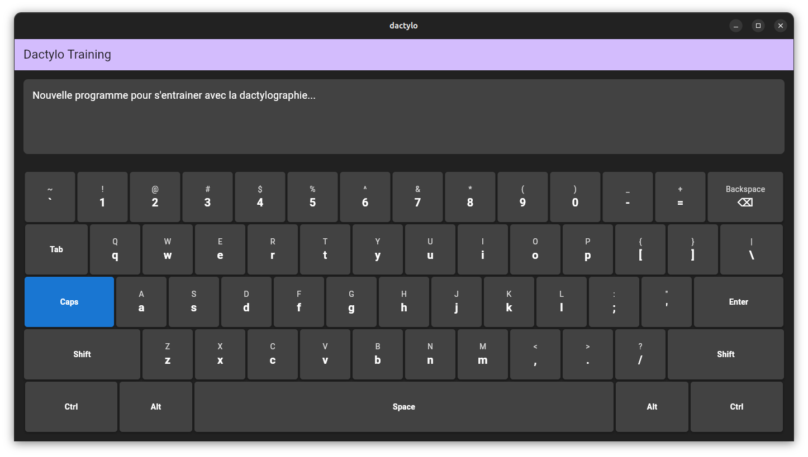

# 📝 Application de Dactylographie - Flutter - Linux  && Windiws



## 📌 Description

Cette application est conçue pour aider les utilisateurs à améliorer leur vitesse et précision en dactylographie. Développée avec **Flutter**, elle offre une interface fluide et interactive compatible avec **Linux** et  **Windows**.

## Les fonctionnalités

✅ Clavier virtuel interactif
✅ Détection en temps réel des touches pressées
✅ Interface moderne et ergonomique

## 🛠️ Technologies utilisées

- **Flutter** : Développement multi-plateforme
- **Dart** : Langage principal
- **Linux**  et **Windows**: OS cible
- **Provider** : Gestion d'état
- **Flutter RawKeyboardListener** : Capture des événements clavier

## 📷 Aperçu


## 📥 Installation

### 🔹 Prérequis
- Avoir **Flutter** installé ([Guide d'installation](https://docs.flutter.dev/get-started/install/linux))
- Avoir un environnement Linux fonctionnel

### 🔹 Étapes d'installation

1. **Cloner le projet**
   ```bash
   git clone https://github.com/votre-repo/dactylo-app.git
   cd dactylo-app
   ```

2. **Installer les dépendances**
   ```bash
   flutter pub get
   ```

3. **Lancer l'application**
   ```bash
   flutter run
   ```

##  Utilisation

1. **Lancer l'application**
2. **Sélectionner un mode d'entraînement**
3. **Commencer à taper et suivre votre progression**
4. **Analyser vos performances grâce aux statistiques**

##  Contribution

Les contributions sont les bienvenues ! Pour contribuer :
1. Forkez le projet
2. Créez une branche (`git checkout -b feature-nouvelle-fonctionnalite`)
3. Commitez vos modifications (`git commit -m 'Ajout d'une nouvelle fonctionnalité'`)
4. Poussez votre branche (`git push origin feature-nouvelle-fonctionnalite`)
5. Ouvrez une Pull Request

## 📄 Licence

Ce projet est sous licence **MIT**. Consultez le fichier [LICENSE](LICENSE) pour plus de détails.

---

🔹 **Développeur :** [RAKOTOMAMPIONONA FITAHIANA HERIZO](https://github.com/Fitahiana-herizo-RAKOTOMAMPIONONA)  
📧 **Contact :** [fitahianaherizo@gmail.com](mailto:fitahianaherizo10@gmail.com)  
💼 **LinkedIn :** [Votre LinkedIn](https://www.linkedin.com/in/fitahiana-herizo-rakotomampionona-586960277/)

